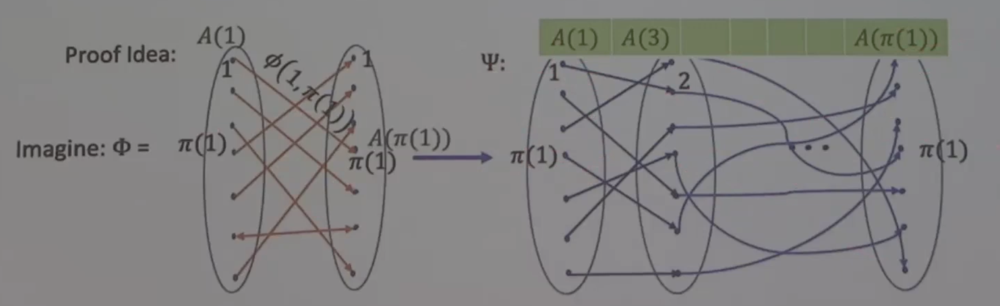

# Derandomized Parallel Repetition

Take a HDX, take each clique of size $k$ within HDX as a single node, and take the constraints within the clique as a mono constraint. For each pair of cliques, if their intersection of node is greater $\sqrt k$, then we have an edge connecting them to check consistency. This results in a reduction of soundness from high constant to low constant.

# Routing Protocol 

Fix graph $G$ and an arbitrary permutation $\pi$ on $V(G)$.

Vertex $u$ want to send data to $\pi(u)$ using only edges on $G$

## Routing Protocol to PCPs

### regular 2-CSP to 2-CSP on regular bipartite graph

We first reduce input 2-CSP graph $G''$ to a regular bipartite graph $G'$ while preserving gap.

Every vertex $u$ in $G''$ is split into two vertices $(u, 1)\in L$ and $(u, 2) \in R$

For every edge $(u, v)$ in the original graph, we add edge $((u, 1), (v, 2))$ in new graph

We also create enforcement constraints $((u, 1), (u, 2))$ for every vertex $u$ in the original graph.

### From 2-CSP on regular bipartite graph to 2-CSP on arbitrary graph with fault-tolerant routing protocol

We can partition original graph $H$, a $2k$-regular graphs into $2k$ perfect matchings.

Suppose we want to embed into graph $G$, a graph with fault tolerant routing protocol.

First, the vertices in $H$ are embedded into $G$. For a node $u$ in $G$, the alphabet would store the value which correspond to $H$, and a table of $2k$ rows where each row stores information with respect to the $i^\text{th}$ perfect matching in $H$. 

Let $T$ be the number of rounds we simulate for the protocol where $T = O(\log |V|)$

For each row in the table of $u$, it would store the message it received from its neighbor $v$ for all time $t\le T$ for the specific perfect matching which is executed as a routing problem via its fault tolerant routing protocol.

### Folding
For the original constraints $\phi(u, v)$, it is checked within the new graph $G$ as follow: In the corresponding perfect matching where $u$ is matched with $v$, $v$ must have received the value of $u$ at some time $t \le T$ when the routing is complete. We simply check if the value received and the value of $v$ stored satisfies the original constraint. Let $\psi$ be the new CSP.

The resulting soundness of $\psi$ is $\le 1 - \frac{1}{|\text{path}|}$, but if the protocol is fault-tolerant, then $\psi$ will have soundness of a constant

Fault-Tolerance: If at most 0.01-fractions of edges of $G$ behave adversarially, then at most 0.01-fractions of message-transmissions fail.

This means we can reduce arbitary CSPs onto HDX if HDX has a fault-tolerant routing protocols.